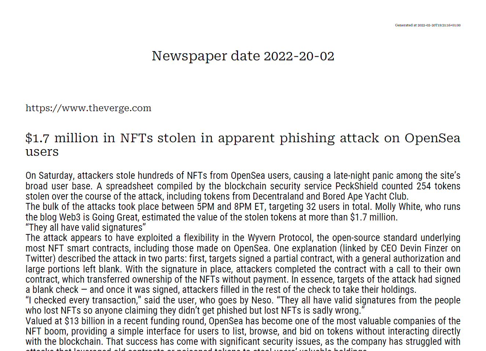

# Newser

A simple utility to crawl some news sites or other resources and download content into a pdf



## Building

Make sure you have `config.yaml` setup and `go` available, then run `go build cmd/newser.go` or just run it from source with `go run cmd/newser.go`

## Configuration

Configuration file is used to guide the pdf building process, right now only website parsing is supported. 

The configuration file must have a top level `defs` (definitions), `font` and `output` properties. Right now `defs` must have a `website` property that contains website definitions.

Default config is part of the source repo.

### Website Definitions

```yaml
-   index: "index-page-url"
    indexSelector: "css-selector-for-articles-index"
    titleSelector: "title-selector-for-articles"
    linkSelector: "selector-for-the-link-for-the-article-content"
    linkAttr: "attribute-to-gather-from-link-selector"
    articleContainerSelector: "article-container-selector"
    articleContentSelector: "article-content-selector"
    ignoreString: "if-found-in-article-article-will-be-ignored"
    removeElems:
        - "selector-in-article-html-to-remove"
        - "someother-selector-in-article-html-to-remove"
    collectOnly: 0 # 0 if you want to collect all articles, or limit to N articles
    disable: 0 # 1 if you want to disable this entry 
```

The good thing is you can be as specific with selectors as you want. So if a website has multiple sections that contain articles, you can have multiple definitions for it and only get the articles that you want. 

## Deps

Top level deps are

* fpdf - "github.com/go-pdf/fpdf" - For generating pdfs
* yaml - "gopkg.in/yaml.v2" - For parsing yamls
* colly - "github.com/gocolly/colly/v2" - For crawling websites

## Contributing

Right now the project is still pretty much done for my desire to read news on my Supernote (awesome gadget btw) so if you wanna do something clever just create a PR.

## Contributors

- [lnenad](github.com/lnenad)

## Licence

Licence is free for personal but paid for commercial, get in touch if you want to use the utility or code for commercial purposes.

## Sponsors


[CapSolver](https://www.capsolver.com/?utm_source=github&utm_medium=banner_repo&utm_campaign=scraping&utm_term=newser) is an AI-powered service that automatically solves a range of CAPTCHAs, helping developers tackle CAPTCHA challenges encountered during web scraping. Whether you're extracting data from e-commerce sites, financial platforms, or social media, CapSolver supports CAPTCHAs like [reCAPTCHA V2](https://docs.capsolver.com/guide/captcha/ReCaptchaV2.html?utm_source=github&utm_medium=banner_repo&utm_campaign=scraping&utm_term=newser), [reCAPTCHA V3](https://docs.capsolver.com/guide/captcha/ReCaptchaV3.html?utm_source=github&utm_medium=banner_repo&utm_campaign=scraping&utm_term=newser), [hCaptcha](https://docs.capsolver.com/guide/captcha/HCaptcha.html?utm_source=github&utm_medium=banner_repo&utm_campaign=scraping&utm_term=newser), [ImageToText](https://docs.capsolver.com/guide/recognition/ImageToTextTask.html?utm_source=github&utm_medium=banner_repo&utm_campaign=scraping&utm_term=newser), [DataDome](https://docs.capsolver.com/guide/antibots/datadome.html?utm_source=github&utm_medium=banner_repo&utm_campaign=scraping&utm_term=newser), [AWS](https://docs.capsolver.com/guide/captcha/awsWaf.html?utm_source=github&utm_medium=banner_repo&utm_campaign=scraping&utm_term=newser), [Geetest](https://docs.capsolver.com/guide/captcha/Geetest.html?utm_source=github&utm_medium=banner_repo&utm_campaign=scraping&utm_term=newser), [Cloudflare Turnstile](https://docs.capsolver.com/guide/antibots/cloudflare_turnstile.html?utm_source=github&utm_medium=banner_repo&utm_campaign=scraping&utm_term=cariddi) and more. With API integration and browser extensions options, and flexible pricing packages, CapSolver adapts to diverse web scraping needs and scenarios. 